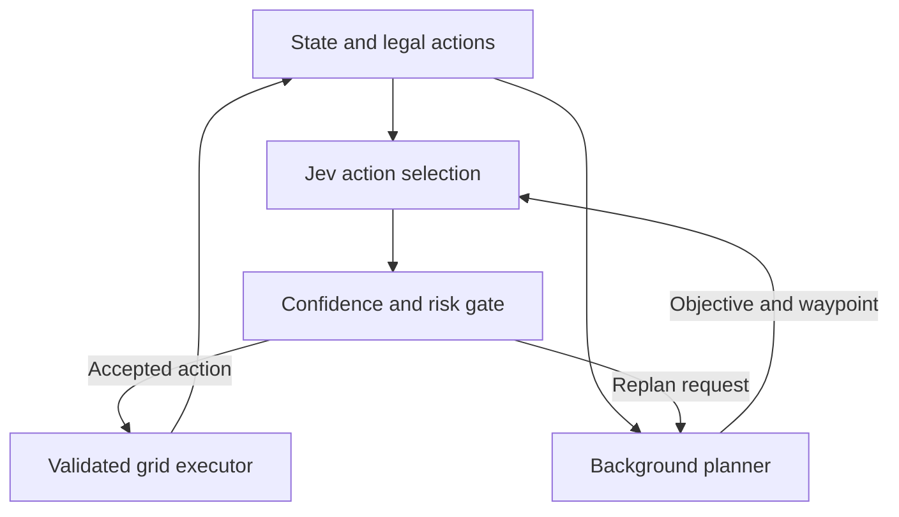

# JevNav Demo

JevNav is a small proof of concept for using [TypeSafe Jev](https://typesafe.ai/)
as a fast, probabilistic reflex layer for embodied agents.

The central split is:

- Jev chooses a **high-level skill** such as `navigate_to:mug_1` or
  `pick_up:mug_1` and simultaneously estimates safety, completion, and whether
  a stronger planner is needed.
- A simulator or conventional controller handles geometry, collision checking,
  and low-level motion.

The dashboard defaults to a deterministic BFS controller, so it runs without
credentials or robot hardware. Jev uses TypeSafe's official HTTP API. An optional
OpenRouter LLM planner supplies objectives and waypoints in the background.
AI2-THOR is still only an initial adapter, not an integrated 3D demo.

## Architecture



## Quick start

### Interactive navigation demo (new)

```bash
pip install -e .
jevnav-dashboard
```

Open http://127.0.0.1:8765. Click **自动运行** or **执行一步**.
The robot collects a mug, the central doorway becomes blocked, and it must
deliver the mug via another doorway. The dashboard shows the grid, subgoal,
candidate actions, selected action, measured decision latency, and execution
results. **导出日志** downloads the current episode as JSON.

The default engine is a deterministic **BFS baseline, not Jev**. This is a
fully observed 2D grid sandbox, not AI2-THOR, visual navigation, or robot physics.
Candidates are generated from current collision and interaction preconditions;
the executor validates them again before moving. Completion is checked by the
environment, not a model's completion score. Episodes stop after 100 actions or
12 consecutive steps without movement or object-state progress.

To use Jev for these same live grid states (no SDK install needed):

```bash
export TYPESAFE_API_KEY='...'
jevnav-dashboard --engine jev
```

The API adapter is not yet validated end-to-end with live credentials. API errors
stop the episode; they never silently switch to the baseline. Keys remain in the
server process. The server binds only to localhost and supports one shared session.
Without a planner, requesting `replan` explicitly stops the episode rather than
repeating an ineffective action. Model-returned actions, probability ranges and
distributions are checked before execution. HTTP errors are sanitized, use a
30-second socket timeout, and stop the episode without automatic retries.

### Enable background planning

Offline check of the planner pipeline (this is still not an LLM):

```bash
jevnav-dashboard --planner rule
```

Jev action selection plus an actual LLM planner:

```bash
export TYPESAFE_API_KEY='your-typesafe-key'
export OPENROUTER_API_KEY='your-openrouter-key'
jevnav-dashboard --engine jev --planner llm --planner-model 'provider/model-id'
```

Replace `provider/model-id` with a model available to your OpenRouter account that
supports JSON mode. `--engine baseline --planner llm` is also supported for testing
the planner independently. The app does not automatically load `.env`; export
variables in the terminal that starts it. `JEV_MODEL` optionally overrides
`jev-latest`.

The planner sees the goal, map, inventory and recent outcomes, and returns an
objective, optional waypoint and notes. Its output becomes part of the next Jev
state. Only one request runs at a time. New plans are requested on task-stage or
map changes, every eight executed actions, on reaching an intermediate waypoint,
or on `replan`. A valid existing plan remains usable during background refresh;
the robot waits when there is no plan for the current stage. Results from a prior
stage, map revision or reset are discarded. Invalid coordinates and blocked
waypoints are rejected. A valid waypoint is not proof that the plan is useful.
Planner errors stop the episode; reset to retry.

The dashboard shows planner status, objective/waypoint, action probabilities,
decision time and Jev input-token totals. Export includes plan lifecycle events
and the context used for each executed action. Planner token/cost accounting is
not yet included.

Architecture inspiration: [rmalde/minecraft-agent](https://github.com/rmalde/minecraft-agent),
particularly executable candidates and action-result feedback. No source code
from that project is copied.

### Original mock CLI

```bash
python -m venv .venv
source .venv/bin/activate
pip install -e '.[dev]'
jevnav --engine mock
```

The mock episode executes: navigate to mug -> pick up mug -> navigate to sink ->
place mug in sink -> stop.

### Use the real Jev API

Get an API key from TypeSafe, then:

```bash
export TYPESAFE_API_KEY='...'
jevnav --engine jev
```

The adapter sends one `Choice`, two status `Noul` questions, and one explicit
risk `Noul` per candidate in the same `POST /v1/systemone` request:

- Which legal high-level skill should run next?
- Would this specific candidate cause a collision or property risk? Each question
  names its action; the gate uses the answer for the selected candidate.
- Does this situation require a stronger planner?
- Is the task complete?

No API key is stored by the project.
Model probabilities and confidence are estimates, not physical safety guarantees.
The grid's deterministic preconditions remain the actual collision check.

Contracts checked against the official documentation:
[TypeSafe HTTP API](https://docs.typesafe.ai/api) and
[OpenRouter chat completions](https://openrouter.ai/docs/api/api-reference/chat/create-a-chat-completion).

### Install AI2-THOR

```bash
pip install -e '.[thor]'
```

`AI2ThorAdapter` currently exposes simulator metadata and a compact set of
discrete motions. Connecting semantic skills such as `navigate_to:<object_id>`
to a shortest-path controller is the next milestone.

## Run tests

```bash
PYTHONPATH=src python -m unittest discover -s tests -v
# With dev dependencies installed, also runs the original pytest functions:
pytest
```

Offline tests cover obstacle avoidance, gated actions, request/response contracts,
malformed model outputs, stale planner results, reset, planner failures, and a
complete episode with fixture API responses. **Fixture responses do not validate
Jev/LLM intelligence, live service availability or real model performance.**
Live calls remain unverified until credentials are configured and an episode runs.

## MVP roadmap

- [x] Typed environment state and action contract
- [x] Batched Jev decision: action + safety + escalation + completion
- [x] Confidence/safety gate
- [x] Fully runnable mock kitchen episode
- [x] Optional AI2-THOR state adapter
- [x] Interactive 2D grid with dynamic obstacle, executable actions and episode export
- [ ] AI2-THOR semantic navigation controller
- [x] Optional background LLM planner integration (live API verification pending)
- [x] Local dashboard with decision latency, action history and map
- [x] Action probability display and Jev input-token totals
- [ ] Full cost accounting and empirical confidence calibration
- [ ] Evaluation: Jev vs LLM vs hybrid

## Why high-level actions?

Jev is a hosted decision API, not a motor controller. It should select semantic
skills at a modest frequency; a local controller should still produce wheel
velocities, joint commands, paths, and collision-free trajectories.
